<!-- 아래 스타일은 chrome browser markdown viewer 플러그인에 맞춰져있습니다. -->
<style>.markdown-body{font-size:14px}th,td{font-size:13px}.markdown-body blockquote{background-color:#ff2a5130;padding:1em 2em}.markdown-body pre code{font-size:.8rem}</style>
<style>#_html{zoom:0.9}#_toc{width:400px;zoom:0.7;}#_toc{line-height:1!important}</style>
<style>#_toc>div>div>div>div>div{display:none}</style>


# POLARION 2304 SDK Documentation


original copy: [Download SDK Guide & Examples](https://almdemo.polarion.com/polarion/sdk/doc/sdk.pdf)


**Unpublished work. © 2023 Siemens**

This material contains trade secrets or otherwise confidential information owned by Siemens Industry Software, Inc., its subsidiaries or its affiliates
(collectively, "Siemens"), or its licensors. Access to and use of this information is strictly limited as set forth in Customer's applicable agreement with
Siemens. This material may not be copied, distributed, or otherwise disclosed outside of Customer's facilities without the express written permission of
Siemens, and may not be used in any way not expressly authorized by Siemens.

This document is for information and instruction purposes only. Siemens reserves the right to make changes in specifications and other information
contained in this publication without prior notice, and the reader should, in all cases, consult Siemens to determine whether any changes have been
made. Representations about products, features or functionality in this document constitute technical information, not a warranty or guarantee, and shall
not give rise to any liability of Siemens whatsoever. Siemens disclaims all warranties including, without limitation, the implied warranties of
merchantability and fitness for a particular purpose. In particular, Siemens does not warrant that the operation of the products will be uninterrupted or
error free.

The terms and conditions governing the sale and licensing of Siemens products are set forth in written agreements between Siemens and its customers.

Siemens' End User License Agreement and Universal Contract Agreement may be viewed at: https://www.sw.siemens.com/en-US/sw-terms/

**TRADEMARKS**: The trademarks, logos, and service marks ("Marks") used herein are the property of Siemens or other parties. Noone is permitted to
use these Marks without the prior written consent of Siemens or the owner of the Marks, as applicable. The use herein of third party Marks is not an
attempt to indicate Siemens as a source of a product, but is intended to indicate a product from, or associated with, a particular third party. A list of
Siemens' trademarks may be viewed at: https://www.plm.automation.siemens.com/global/en/legal/trademarks.html. The registered trademark Linux® is
used pursuant to a sublicense from LMI, the exclusive licensee of Linus Torvalds, owner of the mark on a world-wide basis.

**About Siemens Digital Industries Software**

Siemens Digital Industries Software is a leading global provider of product life cycle management (PLM) software and services with 7 million licensed
seats and 71,000 customers worldwide. Headquartered in Plano, Texas, Siemens Digital Industries Software works collaboratively with companies to
deliver open solutions that help them turn more ideas into successful products. For more information on Siemens Digital Industries Software products
and services, visit https://www.siemens.com/plm.

**Support Center**: https://www.support.sw.siemens.com

**Send Feedback on Documentation**: https://www.support.sw.siemens.com/doc_feedback_form


## 1 SDK Contents


## 2 About SDK

Polarion software development kit is a set of useful information and libraries which will help you learn how to access to Polarion system, either as an
extension via Java application programming interface or remotely, via web services. Start reading of SDK documentation is recommended especially if
you would like to develop:

- Extensions of special Polarion features like workflow function or condition
- Custom servlet for the Home page or Dashboard
- Tomcat applications running in Polarion, e.g. to manipulate work items, traverse repository or, e.g. to check some conditions before committing
  something to the repository (using web services)


## 3 Usage of Polarion API

Polarion Web Services

**What's possible to do with Polarion Web Services**

- Read, modify, or create new work items
- List projects
- Manage users
- Link work items
- List work items by query, available actions or assignees
- List builds
- Create, modify and reuse modules

**What is not possible to do with Polarion Web Services**

- Editing the configuration of Polarion itself. For example, you can't turn email notifications on/off.
- Creating builds
- Editing portals or workflow
- Editing similar settings


## 4 Polarion Java API

Access to the Polarion Server inside the same Java Virtual Machine is provided by several services. The most important ones are listed below. (For the
rest of the available services, see Polarion Java API doc.)

| Service Interface		| functionality
|-----------------------|-----------------------------------------------------------------------------------------------------------------------
| ISecurityService		| The entry point for authentication and authorization tasks. The SecurityService manages the users, roles, relationships and permissions.
| ITrackerService		| The main entry point for tracker-related functions. They are divided by domains into individual managers that provide the following: search, read, creation, modification and the linking of Work Items and their properties such as; work records, attachments, comments and time points.
| ITransactionService	| This service provides a way to persist changes to the repository with several mechanisms like wrapping exceptions and the ability to roll them back in case of error or performing commit action.
| IDataService			| It provides operations with data objects that can be persisted like searching, saving, resolving and viewing their history via revisions.
| IRepositoryService	| The storage of arbitrary files in a hierarchical (folders-files) structure. It lets you work with the repository.
| IExportManager		| Lets you create and delete exports and templates. Exports are available for the following formats: CSV, MS Office Excel table and template, MS Office Word templates, MS Project. (See examples in the section that follows.)
| IDocumentsManager		| This interface contains special methods for operations with Work Items that are stored in Document format (Microsoft Word and Excel) as well as the Documents themselves.
| IBuilderService		| Search and run builds.
| IContextService		| This service builds the logical structure of contexts on top of the repository (repository service) to be used by the rest of the application. The context hierarchy is a tree structure, that can be traversed and dynamically changed over time.
| IAnnouncerService		| Send an announcement via a specified protocol - e.g. SMTP.
| IContributionManager	| This interface discovers existing workflow conditions, functions and validators and their instantiations. It can be used by clients who need to know which conditions, functions, orvalidators are available. (For example, the workflow editor).
| IWorkFlowManager		| Handles the functionality related to workflow. Both for the workflow transitions of Work Items and for work with the workflow configuration.
| IJobUnitFactory		| Service for creating new jobs.
| IShutdownService		| Service that shuts down the Polarion Server.


### 4.1 IExportManager Examples

```java
IExportManager em = trackerService.getExportManager();
IExporterDescriptor desc = em.getExporterDescriptor(null);
```

(For example, `IExporterDescriptor exporter = exportMgr.getExporterDescriptor(IExportManager.EXP_WORD_TEMPLATE);`)

```java
IExportTemplate template = em.getTemplate(desc, null, null);
```

(**IExportTemplate** is a template for export. Export templates can either be managed by the export manager and stored as file in the repository, or
custom templates created using the export template factory for a particular export.)
```java
IExportConfiguration conf = new ModuleExportConfiguration(module, null, null, template, null);
```

An example of **params** in the picture below.

```java
IExport ex = em.startExport(desc, null);
//"conf" created above can be provided as a second argument to the startExport method.

InputStream str = ex.getResult();
```

Example of the **params** argument of a constructor for ModuleExportConfiguration.

See the Javadoc (Polarion\polarion\SDK\doc\javadoc) for more information.

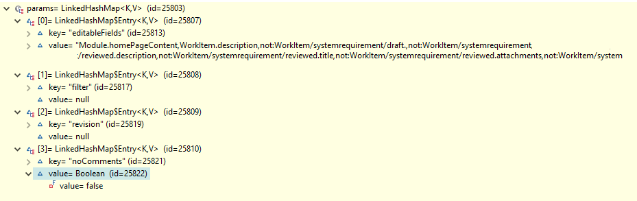


### 4.2 Requirements

**Development Environments**

- [Eclipse IDE for Enterprise Java Developers](https://www.eclipse.org/downloads/) or any other Eclipse IDE with The Eclipse Plug-in Development Environment. (Go to Help > Install
New Software… > Install Eclipse Plug-in Development Environment > Restart Eclipse)
- [Eclipse Temurin™ 17 (LTS) by Adoptium](https://adoptium.net/temurin/releases/) for building and running your code.


### 4.3 Workspace Preparation

**To start developing a Polarion Java API plug-in, you first need to perform following steps:**

1. Start Eclipse, then select **Window > Preferences...**
2. In the dialog that appears, select **Plug-In Development > Target Platform**.
3. Click the **Add** button on the right.
4. Keep the **Nothing: Start with an empty target definition** option selected and click **Next**.  
	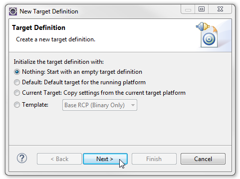  
	*Figure WP-1: Starting with an Empty Target Definition*
5. Enter a **Name** and click **Add**.
6. Select **Directory** and click **Next**.
7. Click **Browse** and select the `C:\Polarion\polarion` folder *(Windows)* or `/opt/polarion/polarion` *(Linux)*. (One level above the plugins folder.)
8. Click **Next**.  
	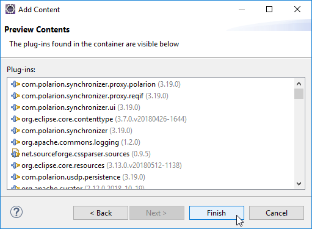  
	*Figure WP-2: Currently Installed Polarion Plug-ins*
9. A list of currently installed Polarion plug-ins appears. Click **Finish**.  
	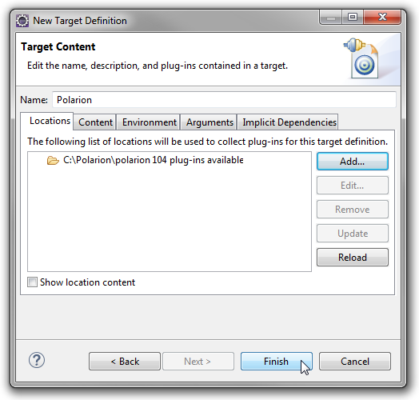  
	*Figure WP-2: Confirm the Selected Path*
10. The selected path and the number of discovered plug-ins available appear. Confirm that the path is correct and click **Finish**.  
	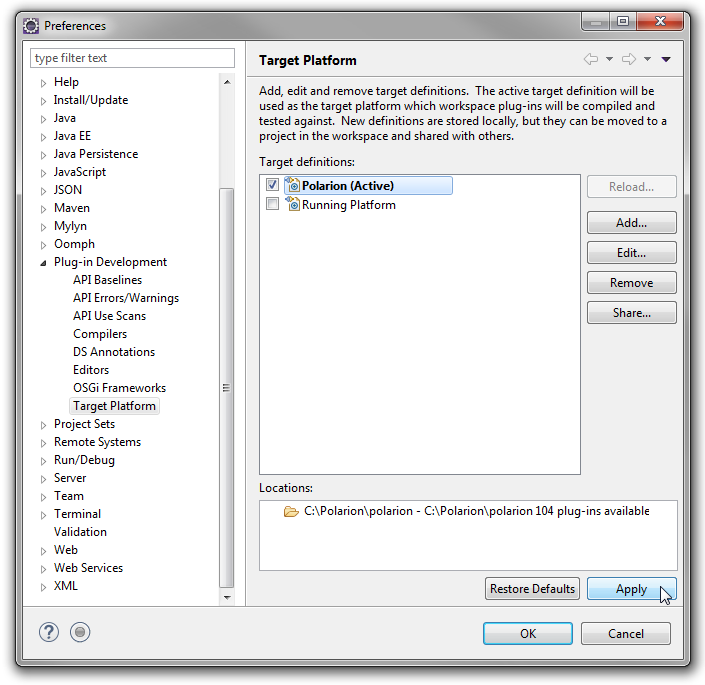  
	*Figure WP-2: Select the Target Platform*
11. Check the box beside the newly added path and click **Apply**.


### 4.4 Deployment to Installed Polarion

You can deploy a plugin to Polarion in two ways. First you can export a project as Deployable Plugins and Fragments. The second way is described in
the following section Execution from Workspace. To export the plug-in, perform these steps:

1. Select **File > Export...**
2. In the dialog that appears, select **Deployable Plugins and Fragments** in **Plug-in Development** section and click the **Next** button.
3. Mark your project (e.g. for **Servlet** example it will be `com.polarion.example.servlet`), and as the destination directory specify the
	polarion folder of your Polarion installation directory (usually in `C:\Polarion\polarion`)
4. At the **Options** card be sure, that **Package plug-ins as individual JAR archives** is unchecked. Click Finish.
5. Because this is a new polarion plug-in extension, you have to restart your Polarion server.

**NOTE**: Servlets loaded by Polarion are cached in: `[Polarion_Home]\data\workspace\.config`. If this folder is not deleted before deploying a
servlet extension (plugin) and restarting Polarion, then either the servlets will not be properly loaded, or the old ones will be loaded.


### 4.5 Execution from Workspace

The second way to deploy the plug-in to Polarion is to launch Polarion directly from your Eclipse workspace. This method has the added advantage of
debugging the code directly in Eclipse.

1. Select **Run** > Open **Debug Configurations**..
2. Create a new Eclipse application (double click on *Eclipse Application*)
3. You should set:  
	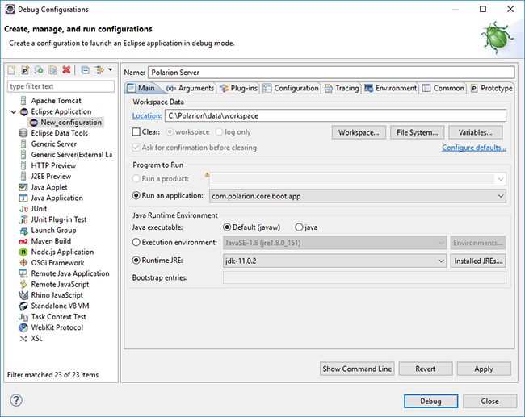  
	*Figure WP-2: Debug - Main page*
	- **Name** to Polarion Server
	- **Workspace Data Location** to `C:\Polarion\data\workspace` (assuming that your Polarion is installed in `C:\Polarion\`).
	- **Run an application** to `com.polarion.core.boot.app` in the Program to Run section.
4. Finally set your Runtime JRE. On the second, **"Arguments"** tab, set the following arguments:

	In the **Program Arguments** section:

	**Windows**:
	```shell
	-os win32 -ws win32 -arch x86 -appId polarion.server
	```
	**Linux**:
	```shell
	-os linux -ws gtk -arch x86_64 -appId polarion.server
	```

	In the **VM Arguments** section:

	**Windows**:
	```shell
	-Xms256m -Xmx640m
	```
	```shell
	-Dcom.polarion.home=C:\Polarion\polarion
	```
	**Linux**
	```shell
	-Xms256m -Xmx640m
	```
	```shell
	-Dcom.polarion.home=/opt/polarion/polarion -Dcom.polarion.propertyFile=/opt/polarion/etc/polarion.properties
	```
5. You must now change the parameters to the Polarion server based on your installation. You can check the settings with the following screenshot:  
	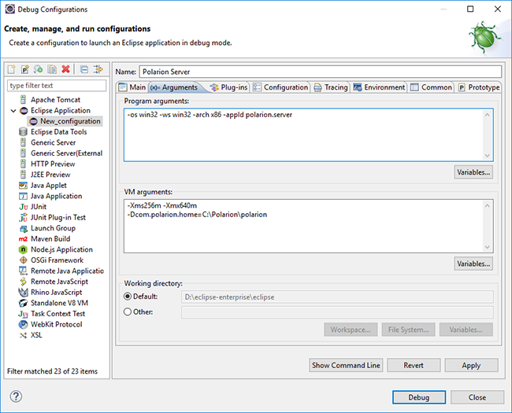  
	*Figure WP-3: Debug - Arguments page*
6. On the third **"Plug-ins"** tab, make sure, you have also selected **"Target Platform"** plugins.
7. Select all, and then click the **Validate Plug-ins** button. If there are some problems, uncheck the plugins which are in conflict.  
	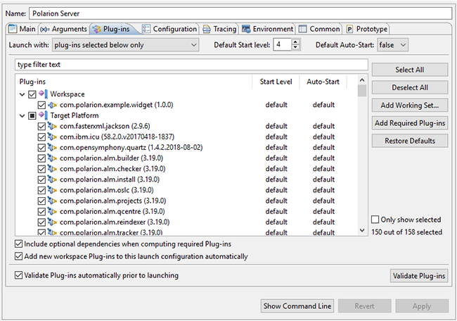  
	*Figure WP-4: Debug - Plug-ins page*
8. Other pages shouldn't be changed. Just click the **Debug** button, and go on with your new Polarion Server application.


## 5 Polarion Web Services API

Polarion provides a set of Document style SOAP Web Services for external integration. For all of these services Polarion provides WSDL and Java client
stubs.

Usual interaction with Web Services using client stubs looks like:
```java
final WebServiceFactory factory = new WebServiceFactory("http://POLARIONHOST:8888/polarion/ws/services/");
final SessionWebService session = factory.getSessionService();
session.login(userName, password);
// your business logic, you can get more stubs from a factory like TrackerWebService, you can start/end transactions on Session Service, etc.

session.endSession();
```

For more information consult Web Services Examples.

**Note that stubs obtained from WebServiceFactory are not thread safe**. If Multiple threads are concurrently accessing a single stub instance,
results can be unpredictable. You should properly synchronize access to these or you can use Thread Confinement and have one stub instance per
each thread. The factory methods on `TrackerWebService` create a new instance with each call.

The following code snippet shows example of how the thread confinement can be achieved.

```java
public static class ThreadCallingWebService implements Runnable {
	private SessionWebService sessionService;
	public ThreadCallingWebService(WebServiceFactory factory) throws ServiceException {
		sessionService = factory.getSessionService();
		// Get all the stubs you need and store them to member variables and make sure these can't escape from the thread.
	}
}

@Override
public void run() {
	sessionService.logIn(userName, password);
	// Do some stuff with stubs.
}
```

The `sessionService` is associated with the thread as a member variable, so no other thread can touch it unless the variable escapes from the thread.

For example the reference is passed to another context where other threads can use it.


### 5.1 WS Requirements

- **Polarion Web Services client** - in `lib/com.polarion.alm.ws.client` you can find compiled libraries of the Polarion web service client, as
	well as the binary of the project, which can be used to import to the Eclipse workspace as the dependency of web service applications. Sources of
	this client are zipped in the same folder.


## 6 Examples

The best way to understand Polarion extensions is to learn from prepared examples. We provide you four examples deployed in the Polarion Server
using the Java API. The first example extends the workflow system by creating one function and one condition. The second example shows you how to
box up in the Repository Overview page your own '.jsp'' page describing some useful information based on properties of relevant projects. Third
example is an implementation of a custom job unit, where checks work items on due date and, if work items are delayed, then it sends notification to
assignee or to global email box. The last example show the way, how to extend notification system by creating new event and new target.

As mentioned in section above, web services are very useful in situations where you need to check something in Polarion before performing some
action, but to do that from a stand-alone application, in which case web services are the best solution. A typical example, which is implemented, is a
hook, which will be called before performing a commit revision to repository (that's why the name is pre-commit hook). The second web service example
shows you a way to quickly develop an application, where you have data on the input (e.g. a CSV file), and you need a batch script to upload it into
Polarion.


### 6.1 Java API Examples

#### 6.1.1 Servlet Example

##### SE - Introduction

This example allows you to create an extension for Wiki pages in form of creating a custom servlet to inform users, e.g. about statistics at the Home or
Dashboard. The result will be your own servlet with a title and body represented by '.jsp' page (written by you) emebedded into a Wiki page.

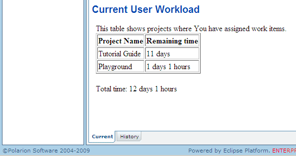  
*Figure SE-1: Expected result*

##### SE - Java API Workspace preparation

See section *Workspace preparation*

##### SE - Import of the example

Info: You must ensure that your plugin is compiled against your Polarion version. This example contains precompiled jar plugin. You can remove it
before you start developing your plugin based on this example. The Eclipse ensure that new jar plugin will be created against your source code and
Polarion version.

To import workflow project example to workspace, do the following steps:

1. Select **File > Import**...
2. In the dialog that appears, select **Existing Project into Workspace** in **General** section and press **Next** button.
3. By pressing **Browse..** button, select the directory of examples (mostly in `C:\Polarion\polarion\SDK\examples\`). Submit it.
4. Select `com.polarion.example.servlet` and press **Finish**.

##### SE - Hints to develop your own plug-in

1. First, we need to create new eclipse plugin: Select **File** > **New..** > **Project**.
2. In the dialog that appears, select **Plug-in Project** and press **Next** button.  
	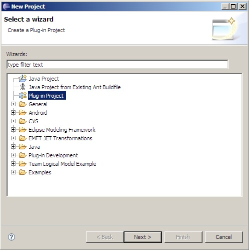  
	Figure SE-2: New Plug-in project
3. Set project name to e.g. `com.polarion.example.servlet`. Press **Next**.
4. Unselect **Generate an activator...** Press **Next**.  
	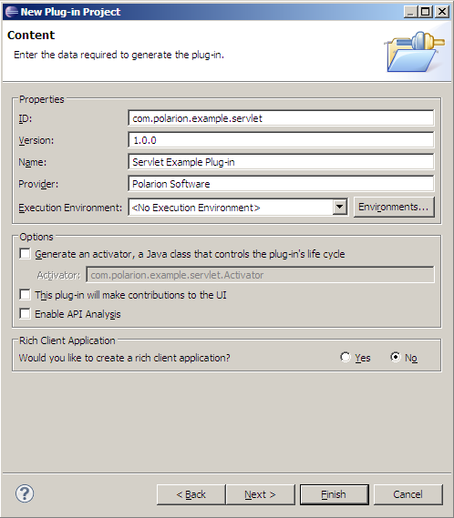  
	Figure SE-3: Third wizard's page
5. Press **Finish**.
6. Open `MANIFEST.MF` from the directory with the same name.
7. Click on the second page - Dependencies and click Add.. button.
8. Type `com.polarion.portal.tomcat` and submit it.
9. Repeat previous two steps, but type `com.polarion.alm.tracker` and submit it.  
	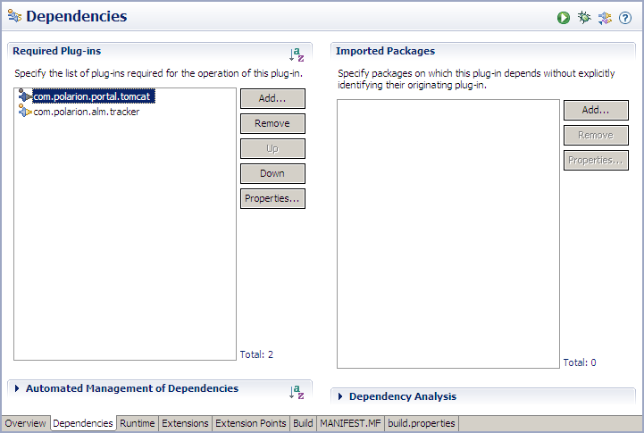  
	Figure SE-4: Dependencies page
10. On the next page click **New..** in the 'Classpath' corner, type `servlet.jar` and submit it.  
	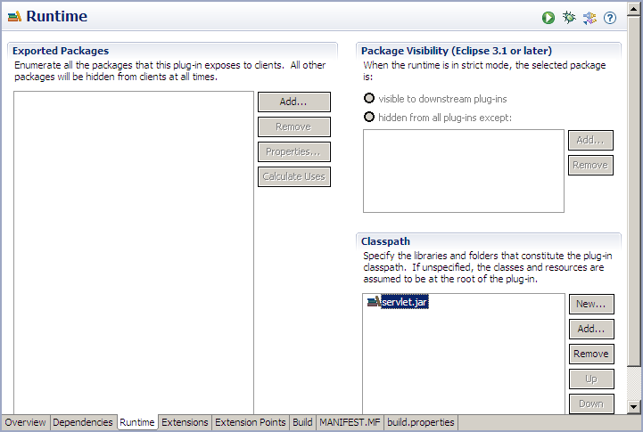  
	Figure SE-5: Runtime page
11. On the next page click **Add..** and choose `com.polarion.portal.tomcat.webapps` extension point and submit it.
12. In **Extension Element Details** set the name for new application with the prefix "polarion/", e.g. "polarion/example" and set **contextRoot** to
	webapp.  
	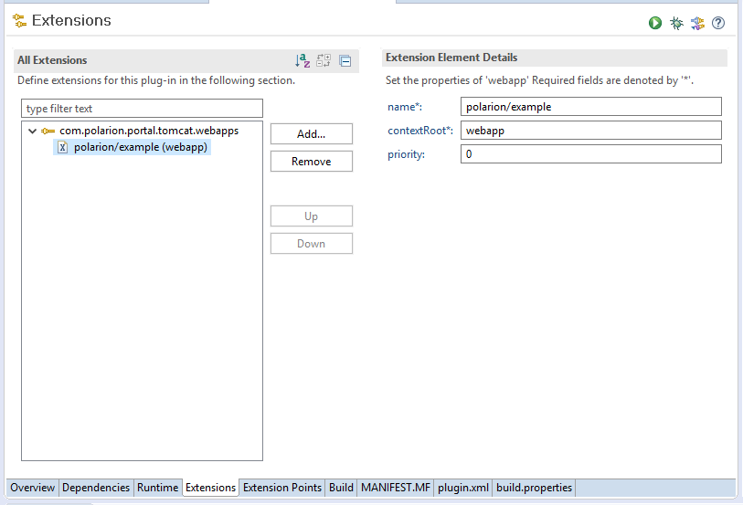  
	Figure SE-6: Extensions page
13. Select folders and files in **Binary Build** corner according to Figure SE-7. (If some folders are missing, You will select them later).
	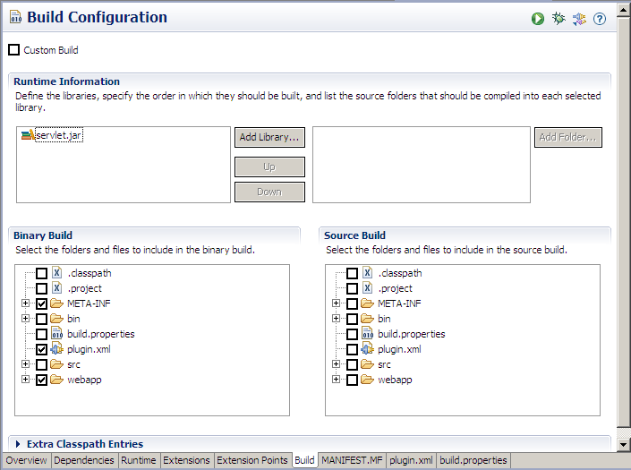  
	Figure SE-7: Build page
14. To check previous steps, you can compare the newly created files with example files.
15. Click on the src directory and select File.. > New > Package and as the name of package You can paste `com.polarion.example.servlet`.
16. Click on the package You have just created and select File.. > New > Class and as the name set the name of your servlet class, e.g.
	`CurrentUserWorkloadServlet`.
17. Click Browse in Superclass row and type here `HttpServlet`. Select OK and press Finish.
18. Create files and directories according Figure SE-8.  
	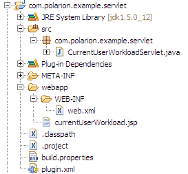  
	Figure SE-8: Projects files and directories

##### SE - Deployment to Installed Polarion

See section *Deployment to Installed Polarion*

##### SE - Execution from Workspace

See section *Execution from Workspace*

##### SE - Configuration

After successful deployment of plug-in into Polarion, you have to include servlet on Dashboard.
- Go to the Dashboard topic on Repository level.
- Edit Dashboard Wiki page by adding these lines:
	```html
	1.1.1 Current User Workload
	<iframe width="100%" height="200" src="/polarion/example/" frameborder="0"></iframe>
	```
- After save you should see your new servlet at the bottom of the page.


#### 6.1.2 Workflow function and condition Example

##### WFCE - Introduction

- The workflow example is a custom workflow function and condition:
- The Compute Total Life Time function will count the time from creation of a work item until the action when status will be set to closed.

The Comments Exist condition will check the state of a work item and if the result is positive then the action will be allowed (and available).

##### WFCE - what's different between function and condition

Workflow condition decides whether a certain action will be performed. If condition is satisfied then action will be available. Workflow function will do
something immediately after confirmation of changes made. So condition is always tested before you start to edit a work item and function is performed
when you finish.

##### WFCE - Work-flow function: Compute Total Life Time

The typical usage of this function is to count the time from creation of a work item until the action triggering setting of status to closed - i.e. the user
marks the work item as done. (Recommended use is to set this function for transitions to the Closed state.)
This function has one parameter with name 'field' the value of which is the name of a custom field. The custom field type must be 'string'. The result will
be saved this custom field only, and the field value will be the time from creation of the work item to this operation. See ~Configuration~ section to see
how to set it in Polarion.

##### WFCE - Work-flow condition: Comments Exist

The typical usage of workflow condition is to check something before an action is performed, e.g. transition to another state. The result is always a
Boolean value, and 'true' means success.

This condition checks whether any comments exist. Returns 'true' if at least one comment exists.

We can assume that we have a work item in the 'open' state and we set the condition for the action 'Resolve and Close':
- Number of comments is equal to 0 which implies that available actions are: Accept, Resolve.
- Number of comments is greater than 0 which implies that available actions are: Accept, Resolve, Resolve and Close.

##### WFCE - Java API Workspace preparation

See section *Workspace preparation*

##### WFCE - Creating project plugin

You can either create or import build project.

##### WFCE - Import of the example

Info: You must ensure that your plugin is compiled against your Polarion version. This example contains a precompiled jar plugin. You can remove it
before you start developing your own plugin based on this example. Eclipse ensures that the new jar plugin will be created against your source code and
Polarion version.

To import workflow project example to workspace, do these steps:
1. Select **File** > **Import**...
2. In the dialog that appears, select **Existing Project into Workspace** (in the **General** section) and press the **Next** button.
3. Press the **Browse..** button, select the directory of examples (usually in `C:\Polarion\polarion\SDK\examples\`). Submit it.
4. Select `com.polarion.example.workflow` and press **Finish**.

###### WFCE - Develop your own plug-in
- First, you have to create new plug-in project. Fill Plug-In Properties and uncheck **Generate activator..**
- Afterwards, open `MANIFEST.MF` and set `com.polarion.alm.tracker` as a Required Plug-in in the Dependencies page. You should also set,
in the Build page, the `src/` folder as the source folder that should be compiled into the exported library.  
	**Figure 1. build.properties file content**
	```
	source.. = src/
	output.. = bin/
	source.example-plugin.jar = src/
	bin.includes =	META-INF/,\
					example-plugin.jar,\
					.
	```
- To let Polarion Server know that you have created new workflow function or condition, you have to create a **META-INF** directory in the **src** folder,
	and place the `hivemodule.xml` file there. See `hivemodule.xml` of the example for more information.

##### WFCE - Build and deployment

There are two basic types of plugins for Polarion. First is a 'standard' plugin that contains only source code. The second is a 'web application' plugin, or
plugin with external resources. For example, web application using special directory called *webapp*.

This directory contains external resources (web pages, images) which will be deployed by a web server to Polarion (see also Servlet Example, how to
add webapp directory to web server). If you want to develop a web based application or plugin with external resources for Polarion you must separate
the webapp or resource directory from the jar plugin.

This can be done with the `build.properties` file. You can add these lines to `build.properties`:
```
bin.includes =	META-INF/,\
				plugin.xml,\
				webapp/,\
				example-plugin.jar
```

As we can see, the `example-plugin.jar` is our plugin for Polarion which will be deployed in the `plugin` directory. This plugin directory also contains
the webapp directory with our pages and images.

The advantage of this deployment is that you are able to access these resource, because it's not packed in the jar plugin directly.

##### WFCE - Deployment to Installed Polarion

See section *Deployment to Installed Polarion*

##### WFCE - Execution from Workspace

See section *Execution from Workspace*

##### WFCE - Configuration

After successful deployment of your plug-in to Polarion, you can start using new the workflow function and condition. To check, that deployment was
successful do following steps:
- Enter the Administration interface, open the project in which you would like to set new function.
- Go to Work Items > Workflow
- Go to right-most column and create a new configuration for a specific type of work item.
- In the Work Flow Designer, go to last portlet 'Actions' and click on the Edit icon (a white check mark in purple circle) on the row for any action. It
	will display a popup editor of the action details (conditions and functions) which are already specified. There you should see the new condition and
	function.  
	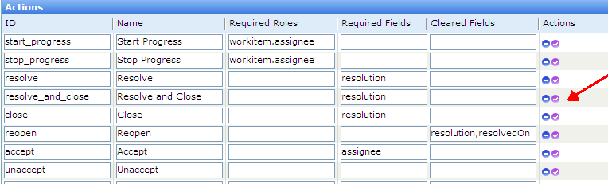  
	*Figure WFCE-1: Choose the action, where you would like to set condition or function* 
	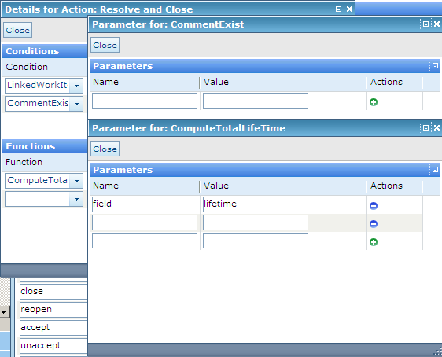  
	*Figure WFCE-2: Set properties according the image*


#### 6.1.3 Job Example

##### JE - Introduction
The Job example is an implementation of a custom job unit. The implementation checks work items on due date and, if work items are delayed, it sends
notification to assignee or to global email box. The example also covers building a parameterized job unit, which allows you to define parameters for a
job and send announcements through the IAnnouncerService API class.

This example also shows you another part of Polarion, which allows you to create an extension for the scheduler system. The scheduler executes jobs
periodically and it can compute some statistics based on work items.

##### JE - What is Scheduler and Job?

Scheduler is organizer for jobs. You can edit your jobs through the scheduler for periodic execution or monitor your jobs. Scheduler is inspired by Cron
scheduler and you can easily maintain executions with Cron expressions. It allows you to set executions every five minutes, every hour or however you
like.

Jobs are the implementation unit for the Scheduler and they are periodically executed by the Scheduler. Action of a job can vary widely - from some
trivial calculation based on work items to sending periodic build analysis reports.

##### JE - Overdue job: Check for overdue work items

The typical usage of work items is that it allows you to specify the due date for resolution. If you have many work items in tracker, it's quite complicated
to inform every user about his delay. This task can be easily realized with Job. You can extend Schedule for your own job that can periodically check
every work item if it's resolved to due date or not. And then if you find some delayed work items you can send notifications for every assignee of work
item.

##### JE - Java API Workspace preparation

See section *Workspace preparation*

##### JE - Creating project plugin

###### JE - Import of the example
Info: You must ensure that your plugin is compiled against your Polarion version. This example contains precompiled jar plugin. You can remove it
before you start developing your plugin based on this example. The Eclipse ensure that new jar plugin will be created against your source code and
Polarion version.

To import workflow project example to workspace, do these steps:
1. Select **File** > **Import...**
2. In the dialog that appears, select **Existing Project into Workspace** in **General** section and press Next button.
3. By pressing **Browse..** button, select the directory of examples (mostly in `C:\Polarion\polarion\SDK\examples\`). Submit it.
4. Select `com.polarion.example.job` and press Finish.

##### JE - Hints to develop your own plug-in

- First, you have to create new plug-in project. Fill Plug-In Properties and uncheck **Generate activator..**
- Afterwards, open `MANIFEST.MF` and set `com.polarion.alm.tracker`, `com.polarion.platform.jobs` as a Required Plug-in in
	Dependencies card. As well, you should set at Build card the `src/` folder as the source folder that should be compiled into exported library.
	```
	### content of 'build.properties' file ###
	source.. = src/
	output.. = bin/
	bin.includes =	META-INF/,\
					.
	```

##### JE - Deployment to Installed Polarion

See section *Deployment to Installed Polarion*

##### JE - Execution from Workspace

See section *Execution from Workspace*

##### JE - Configuration

After successful deployment of plug-in into Polarion, you can start using new job in Scheduler. To check that deployment was successful do following
steps:
1. Select the Repository view. Go to Administration perspective, choose the Scheduler, where you can add your new job.
2. Edit the global configuration for jobs and add these lines for the Overdue job example:
	Job can be programmable with properties which will be injected into the job implementation by the Scheduler.
	```xml
	<job name="overdue.job" id="overdue.job" cronExpression="0 0 1 ? * MON-SAT" scope="project:playground">
		<query></query>
		<sort>~updated</sort>
		<notificationSender>polarion@example.com</notificationSender>
		<notificationSubjectPrefix>[Polarion]</notificationSubjectPrefix>
		<notificationRecipients>assignee</notificationRecipients>
		<planningConstraint>dueDate</planningConstraint>
		<allowedDelay>0</allowedDelay>
	</job>
	```

3. Then you can switch to the Projects perspective, choose Monitor and monitor your new job:
	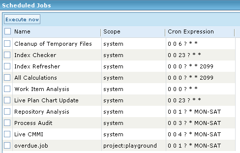  
	*Figure JE-1: Screenshot of monitor of the new job*


#### 6.1.4 Notification Extension Example

##### NEE - Introduction

In this example we will show how to create custom notification target.

###### what is possible to extend

- **custom target** - extend configuration in Administration -> Notifications -> Targets

###### what will be shown in the example

1. how to create custom target - we will implement `custom-field-targets` target which will ensure that notifications will be sent to users with IDs
	found in certain custom field

##### NEE - Java API Workspace preparation

See section *Workspace preparation*

##### NEE - Creating project plugin

You can import already implemented example or read what steps are necessary to extend Polarion notification system.

###### NEE - Import of the example
Info: You must ensure that your plugin is compiled against your Polarion version. This example contains precompiled jar plugin. You can remove it
before you start developing your plugin based on this example. The Eclipse ensure that new jar plugin will be created against your source code and
Polarion version.  
To import workflow project example to workspace, do these steps:
1. Select **File** > **Import...**
2. In the dialog that appears, select **Existing Project into Workspace** in **General** section and press Next button.
3. By pressing **Browse..** button, select the directory of examples (mostly in `C:\Polarion\polarion\SDK\examples\`). Submit it.
4. Select `com.polarion.example.notifications` and press Finish.

###### NEE - Extending Polarion notification system in own way
- Create new plug-in project. Fill Plug-In Properties and uncheck **Generate activator..**
- Create `META-INF` directory in src folder and `hivemodule.xml` file inside.
- In hivemodule.xml you can set one contribution point:
	1. `com.polarion.psvn.core.notifications.targets` to register new target
	See hivemodule.xml file included in example for syntax and more details.
- Open `MANIFEST.MF` and set `com.polarion.alm.tracker`, `com.polarion.platform.persistence`, `com.polarion.psvn.launcher`
	as a Required Plug-in in Dependencies card. As well, you should set at Build card the `src/` folder as the source folder that should be compiled
	into exported library.
	```
	### content of 'build.properties' file ###
	source.. = src/
	output.. = bin/
	bin.includes =	META-INF/,\
					.
	```
- See how to manually set targets for email notifications in the documented example code.

##### NEE - Deployment to Installed Polarion

See section *Deployment to Installed Polarion*

##### NEE - Execution from Workspace

See section *Execution from Workspace*

##### NEE - Configuration

After successful deployment of plug-in into Polarion, you can modify notification configuration to start using the new event and target:
1. Select the Repository or project view. Go to Administration perspective, choose Targets in the Notifications section.
2. Select the required event.
3. In the *Target* drop-down, select your custom notification target (`custom-field-targets` for SDK, for example). Assuming such field is is
	defined (see the documented example code for `com.polarion.example.notifications.targets.CustomFieldTargets`), then in the
	optional field that appears, input additional information.  
	When you use custom-field-targets for the workitem-commented event, then users whose IDs are entered in the optional field on the right side
	from the drop-down will be notified when a new comment is added to a particular Work Item. NOTE: the IDs must be delimited by commas (,)


#### 6.1.5 Form Extension Example

##### FEE - Introduction

In this example we will show how to create custom form extension.

###### what is possible to extend
- **form layout** - we will demonstrate how to add your own custom form extensions in to form layout

###### what will be shown in the example
1. how to create custom extension - we will implement extension that shows how many work items with same severity there are in the same project

##### FEE - Java API Workspace preparation

See section *Workspace preparation*

##### FEE - Creating project plugin

The best way is to import provided example, which contains all dependencies you need for custom plugin creation

###### FEE - Import of the example
Info: You must ensure that your plugin is compiled against your Polarion version. This example contains precompiled jar plugin. You can remove it
before you start developing your plugin based on this example. The Eclipse ensure that new jar plugin will be created against your source code and
Polarion version.  
To import this example to workspace, do these steps:
1. Select **File** > **Import...**
2. In the dialog that appears, select **Existing Project into Workspace** in **General** section and press **Next** button.
3. By pressing **Browse..** button, select the directory of examples (mostly in `C:\Polarion\polarion\SDK\examples\`). Submit it.
4. Select `com.polarion.example.formextension` and press **Finish**.

##### FEE - Deployment to Installed Polarion

See section *Deployment to Installed Polarion*

##### FEE - Execution from Workspace

See section *Execution from Workspace*

##### FEE - Configuration

After successful deployment of plug-in into Polarion, you can modify form layout configuration to start using new form extension:
1. Select the Repository or project view. Go to Administration perspective, choose Form Configuration in Work Items section, here in Form Layout
	section select a layout where you would like to display your form extension and hit edit. Or you can create a new one. There you can add
	following code:
	```xml
	<extension id="example" label="Example Extension"/>
	```
	The extension id is id you have provided in implementation of the extension
	```java
	protected void configure() {
		Contributions<FormExtensionContribution> contributions =
		new Contributions<FormExtensionContribution>(binder(), FormExtensionContribution.class);
		contributions.addBinding().toInstance(
		new FormExtensionContribution(FormExtensionExample.class, "example"));
	}
	```


#### 6.1.6 Enumeration Factory Example

##### EFE - Introduction

In this example we will show how to create custom enumeration factory.

###### what will be shown in the example
1. how to create custom enumeration factory- we will implement factory for Time Point enumeration

##### EFE - Java API Workspace preparation

See section *Workspace preparation*

##### EFE - Creating project plugin

The best way is to import provided example, which contains all dependencies you need for custom plugin creation

###### EFE - Import of the example
Info: You must ensure that your plugin is compiled against your Polarion version. This example contains precompiled jar plugin. You can remove it
before you start developing your plugin based on this example. The Eclipse ensure that new jar plugin will be created against your source code and
Polarion version.  
To import this example to workspace, do these steps:
1. Select **File** > **Import...**
2. In the dialog that appears, select **Existing Project into Workspace** in **General** section and press **Next** button.
3. By pressing **Browse..** button, select the directory of examples (mostly in `C:\Polarion\polarion\SDK\examples\`). Submit it.
4. Select `com.polarion.example.enumerationfactory` and press **Finish**.

##### EFE - Deployment to Installed Polarion

See section *Deployment to Installed Polarion*

##### EFE - Execution from Workspace

See section *Execution from Workspace*

##### EFE - Configuration

After successful deployment of plug-in into Polarion, you can modify custom fields configuration to start using new enumaration factory:
1. Select the Repository or project view. Go to Administration perspective, choose Custom Fields in Work Items section and go to editor for specific
	work item type. Here in editor select Type "Enum:" and new option "My Time Points".


#### 6.1.7 Administration Extension Example

##### AEE - Introduction

In this example we will show how to create custom administration page.

###### what will be shown in the example
1. how to create custom administration page
2. how to register custom administration page to Polarion

##### AEE - Java API Workspace preparation

See section *Workspace preparation*

##### AEE - Creating project plugin

The best way is to import provided example, which contains all dependencies you need for custom plugin creation

###### AEE - Import of the example

Info: You must ensure that your plugin is compiled against your Polarion version. This example contains precompiled jar plugin. You can remove it
before you start developing your plugin based on this example. The Eclipse ensure that new jar plugin will be created against your source code and
Polarion version.

To import this example to workspace, do these steps:
1. Select **File** > **Import...**
2. In the dialog that appears, select **Existing Project into Workspace** in **General** section and press **Next** button.
3. By pressing **Browse..** button, select the directory of examples (mostly in `C:\Polarion\polarion\SDK\examples\`). Submit it.
4. Select `com.polarion.example.administration` and press **Finish**.

##### AEE - Deployment to Installed Polarion

See section *Deployment to Installed Polarion*

##### AEE - Execution from Workspace

See section *Execution from Workspace*

##### AEE - Configuration

Custom administration pages are registered via hivemodule.xml to contribution with id
`com.polarion.xray.webui.administrationPageExtenders`.

Extender attributes: id (required), name, iconUrl, pageUrl, parentNodeId, parentNodeName, parentNodeIconUrl, projectScope (Boolean),
projectGroupScope (Boolean), repositoryScope (Boolean)

```xml
<?xml version="1.0" encoding="UTF-8"?>
<module id="com.polarion.example.administration" version="1.0.0">
	<contribution configuration-id="com.polarion.xray.webui.administrationPageExtenders">
		<extender id="administrationExample"
			parentNodeId="administrationExampleFolder"
			name="Page" parentNodeName="Example"
			parentNodeIconUrl="/polarion/icons/default/topicIcons/Tools_157-wrench.png"
			iconUrl="/polarion/icons/default/topicIconsSmall/Tools_158-wrench-2.png"
			pageUrl="/polarion/administrationExample/administration.jsp?scope=$scope$"
			projectScope="true" projectGroupScope="true" repositoryScope="true"/>
	</contribution>
</module>
```


#### 6.1.8 Custom Exporter Example

##### CEE - Introduction

This exporter lets you test the export of Work Items into a JSON file.

##### CEE - Development Environment

See *section Requirements*.

##### CEE - Workspace Preparation

If you do not yet a have a workspace prepared for Polarion plugin development, please see sections Workspace preparation before proceeding with this
chapter.

You must first import the **com.polarion.example.exporter** project from the `SDK\example` directory.
(`Polarion\polarion\SDK\examples\com.polarion.example.exporter` by default.)

###### Import the com.polarion.example.exporter project:
1. Start Eclipse, then select **File** > **Import...**
2. Select **Existing Projects into Workspace** in the **General** section of the dialog that appears.
3. Click **Next**.
4. Click **Browse** and select the **com.polarion.example.exporter** directory.
5. Click **OK**.
6. Select the **com.polarion.example.exporter** project from the **Projects** subwindow and click **Finish**.

##### CEE - Execution

To see how to run/debug Polarion with the example plugin see sections *Deployment to Installed Polarion and Execution from Workspace*.

Once Polarion is running, execute the following steps to see how the Custom Exporter Example works:

1. Select a **Work Item** in Polarion from the 
	**Tree** or 	**Table** views.
2. Click on the 	icon in the toolbar.
3. Click  **Export**.
4. Open the **Format** drop-down list.
5. If the plugin import is successful, you will see the option **json: Example Exporter** among the items of the list.
6. If the option fails to appear in the drop-down list, double-check if the `com.polarion.example.exporter` is among the selected plug-ins in the
	Run/Debug options of your IDE.
7. Select **json: Example Exporter**.
8. *(Optional)* Click **Show Advanced options** to view the exporter's custom parameters.
9. Click **OK**.

##### CEE - Hivemind Parameters

This sample code showcases how Hivemind parameters can be defined and used in the code. In this example, I have created 4 custom parameters:
**max_workitems_for_export**, **write_result_in_german**, **english_result_message** and **german_result_message**, which are defined in the
hivemodule.xml of the plugin and are of the type Integer, Boolean, String and String respectively. All of these types are supported and the usage of the
parameters in the code can be seen in different parts of the `ExampleExporterCommand.java` class. The parameter **max_workitems_for_export**
limits the number of Work Items exported. The effect of the **write_result_in_german** parameter can be seen in the text shown in the export dialog once
the export has successfully ended. If the parameter is set to true, the final message shown there will be in German (as defined in the
**german_result_message** parameter), otherwise it will be shown in English (as defined in the **english_result_message** parameter).

Info: The `contentType` in the hivemodule's `exporterDescriptor` section is the MIME type of the exported content.

##### CEE - Custom Export Fields

If you are not satisfied with the kind of methods and capabilities the default export fields in Polarion exporters have, you can create your own custom
export field. An example of that can be seen in the examples `CustomExporterField.java` class. It implements the `IExportField` API interface
and is given additional methods to set the `readOnly` and `columnWidth` fields. The former is then used in `ExampleExporterCommand.java` to apply
the read-only status to fields based on own preferences and needs.


### 6.2 Web Services Examples


#### 6.2.1 Import of Workitems Example

##### IWSE - Introduction

**Import of work items** is an standalone application which shows a way how to import work items to Polarion Server via web services at the base of data,
which are stored in **comma separated value** file in the following format:

- Each line of the CSV file has to have 4 columns separated by semicolon or other item delimiter which is defined in `settings.properties`.
- The meaning of ordered columns is:
	1. title
	2. one line description
	3. severity (case insensitive, when not found in Polarion, new severity for just this WI will be defined)
	4. categories (can be more categories separated by comma. Category can be written as category id or category name defined in Polarion or
		in other case, category for just this WI will be defined).

The result of execution is message about success of import operation.

###### IWSE - Example of using

1. There are data, which we would like to import to Polarion (in CSV file):
	```
	Filter also administration topics by Hats;description1;Major;Administration
	```

Watch the available disk space;description2;Major;Notifications,defect,Test Suite

- Now run the following shell script command:
	**import.bat \<CSV_File_Path\>**
- The command window should show a message confirming that the Work Items were imported successfully.
- The imported Work Items should be available as shown below :
	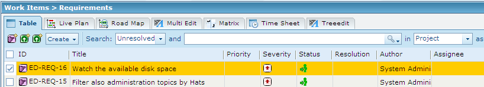
	*Figure IWSE-1: Screenshot of expected result*

##### IWSE - Requirements

###### IWSE - Development Environment
- [Eclipse IDE](https://www.eclipse.org/downloads/)
- [Eclipse Temurin™ 17 (LTS) by Adoptium](https://adoptium.net/temurin/releases/)

###### IWSE - Web service client
- You have to use Polarion web service client libraries stored in lib directory of Polarion SDK (this is usually in MS Windows systems
	`C:\Polarion\polarion\SDK\lib\com.polarion.alm.ws.client\.`)

##### IWSE - Workspace Preparation
- First, You have to import web service client project `com.polarion.alm.ws.client` from `SDK\lib\` directory. For this action, perform these  
	steps:
	1. Start Eclipse, then select **File** > **Import...**.
	2. In the dialog that appears, select **Existing Projects into Workspace** in **General** section. Submit it by Next button.
	3. By pressing Browse.. button, select the `directory com.polarion.alm.ws.client`. Press OK.
	4. In subwindow Projects select `com.polarion.alm.ws.client` project and press **Finish**.
- To start working with web services, you can import example project or you can create your own project.
	- To import example project, perform the same steps as the import of web service client project described above, except the name of project
		- the example project is located in `SDK\examples\com.polarion.example.importer`.
	- To create Your own new Polarion web service project, perform these steps:
		1. Select **File** > **New** > **Java Project**.
		2. Type project name and click **Next** button.
		3. Select Projects card and click the button **Add...**.
		4. Select `com.polarion.alm.ws.client` project and submit it.
		5. Select **Finish**.

##### IWSE - Execution

You can execute example in Run or Debug mode or You can export it as a jar file and create appropriate shell script.

- Execute in Debug mode:
	1. Select **Run** > **Open Debug Dialog...**
	2. Create new Java application, set the name, click **Search..** in Main class section.
	3. In new pop-up window select `com.polarion.example.importer.Importer` class.
	4. In the second card - Arguments , set the name (or path) to CSV file in Program arguments section.
	5. Click **Debug** button
- Export as jar archive:
	1. Select **File** > **Export...**
	2. Select JAR file in Java section, click **Next...**
	3. Mark our project (e.g. this example) and set location of new JAR archive.
	4. Click **Finish** button
	5. To run the jar, You can use MS Windows script `import.bat` stored in example folder.

##### IWSE - Configuration and usage

To start using example, you have to set information about Polarion Server in `settings.properties` file.

###### IWSE - settings.properties
This file have to be stored in the same directory level as compiled project. The format is: `key=value`. Following keys have to be set:
- `polarion_server_address`, e.g. 'http://localhost'
- `polarion_server_port`, e.g. '81'
- `user`, e.g. 'admin'
- `passwd`, e.g. 'admin'
- `project_id`, e.g. 'requ' (Requirements project)
- `module`, e.g. 'Playground Module' - default is to import work items outside of any module
- `item_delimiter`, e.g. ';'
- `wi_type`, e.g. 'requirement' - default value is set to "requirement", all imported work items will have 'wi_type' type

###### IWSE - Example of CSV data:
```
Filter also administration topics by Hats;description1;Major;User Management, Administration
Watch the available disk space;description2;Major;Backend, User_man
```

###### Terms defined in Polarion:
- severity Major(id=major, name=Major)
- categories User Management(id=User_man, name=User Management), Backend(id=Backend, name=Backend)


#### 6.2.2 Pre-commit hook Example

##### PHE - Introduction

###### PHE - About Pre-commit hook
The pre-commit hook is invoked before a Subversion transaction is committed. Subversion runs this hook by invoking a program (script, executable,
binary, etc.) named 'pre-commit', with the following ordered arguments:

1. REPOS-PATH (the path to this repository)
2. TXN-NAME (the name of the transaction to be committed)

If the hook program exits with success, the txn is committed; but if it exits with failure (non-zero), the txn is aborted, no commit takes place, and
STDERR is returned to the client.

For more information see: hook scripts.

###### PHE - About this example application
This hook runs java application, which will check, if the comment of commit message contains a link of work item, which have to be resolvable and not to
be resolved. The idea is to ensure, that each revision will be linked to not resolved work item.

The return code of application equals 0 if the link to work item in commit message is valid. You should set the path to log file, where errors will be
written. See *Configuration and usage* section to see the configuration file.

###### PHE - Some examples of using
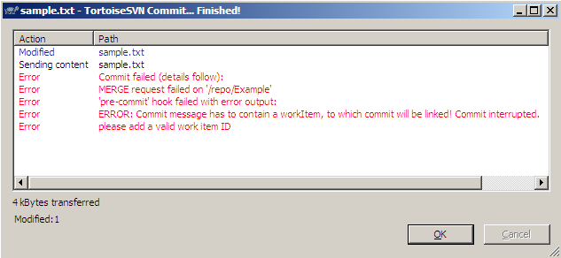  
*Figure PHE-1: The case, when you do not set any message*

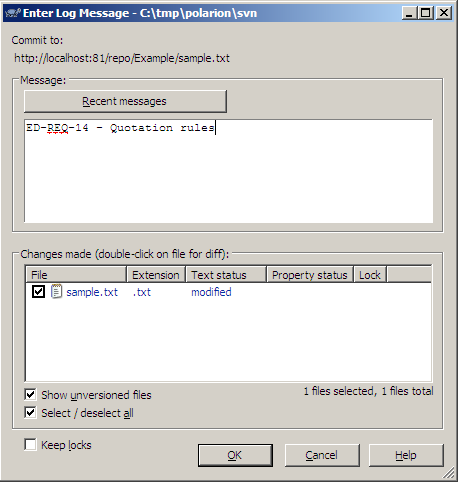  
*Figure PHE-2: The case, when you set right message and the work exist but is not resolved*

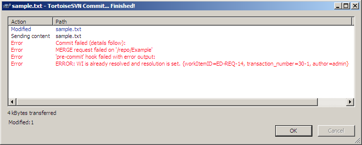  
*Figure PHE-3: The case, when you set right message, but work item is resolved (state is 'Closed')*


##### PHE - Requirements

###### PHE - Development Environment
- Eclipse IDE
- Eclipse Temurin™ 17 (LTS) by Adoptium

###### PHE - Web service client
- You have to use Polarion web service client libraries stored in lib directory of Polarion SDK (this is usually in MS Windows systems
	`C:\Polarion\polarion\SDK\lib\com.polarion.alm.ws.client\.`)

##### PHE - Workspace Preparation
- First, You have to import web service client project com.polarion.alm.ws.client from SDK\lib\ directory. For this action, perform these  
	steps:
	1. Start Eclipse, then select **File** > **Import...**.
	2. In the dialog that appears, select **Existing Projects into Workspace** in **General** section. Submit it by **Next** button.
	3. By pressing **Browse..** button, select the directory `com.polarion.alm.ws.client`. Press **OK**.
	4. In subwindow Projects select `com.polarion.alm.ws.client` project and press finish.
- To start working with web services, you can import example project or you can create your own project.
- To import example project, perform the same steps as the import of web service client project described above, except the name of project
	- the example project is located in `SDK\examples\com.polarion.example.commithook`.
	- To create Your own new Polarion web service project, perform these steps:
		1. Select **File** > **New** > **Java Project**.
		2. Type project name and click **Next** button.
		3. Select Projects card and click the button **Add...**.
		4. Select `com.polarion.alm.ws.client` project and submit it.
		5. Select **Finish**.

##### PHE - Execution

To execute the example, you have to export it as a jar file and create appreciate shell script. For this action, perform these steps:

1. Select **File** > **Export..**.
2. Select JAR file in Java section, click **Next...**
3. Mark our project (this example = `com.polarion.example.commithook`) and set location of new JAR archive (together with name of new jar
	archive, e.g. `pre-commit.jar`).
4. Click **Finish** button

To run the jar, you can use windows script: (see at `pre-commit.bat` file in commit hook example folder)

So, what You have to do:
- you have to save this script to your svn hook directory (e.g. Polarion svn hook dir = `C:\Polarion\data\svn\repo\hooks\`).
- set **POL_PROP** variable of properties, where are set the address of Polarion server, login, password, .. For detailed information see Configuration
	and usage section.
- set **PRE_COMMIT_JAR** variable to the same location, where you export the project (in previous step).
- set **JAVA_HOME** variable to the same JAVA environment, as you use to compile this project.
- set **POLARION_SDK_DIR** variable according your system and Polarion installation.

##### PHE - Configuration

To start using example, you have to set information about Polarion Server in settings.properties file.

###### PHE - settings.properties
- `The` format is: key=value. Following keys have to be set:
- `polarion_server_adr`, e.g. 'http://localhost' - address of Polarion server
- `polarion_server_port`, e.g. '81' - port of Polarion server
- `user`, e.g. 'admin' - name of the user to log in to Polarion
- `passwd`, e.g. 'admin' - password for 'user'
- `project_id`, e.g. 'requ' (Requirements project) - ID of project of WorkItem typed in commit message
- `svnlook_dir`, e.g. 'C:\\Polarion\\bundled\\svn\\bin\\' - path to dir, where svnlook is placed
- `svnlook_cmd`, e.g. 'svnlook.exe' - svnlook program file name
- `apache_log_folder`, e.g. 'C:\\Polarion\\data\\logs\\apache\\' - the path of dir, where log of errors should be placed
- `apache_log_file_name`, e.g. 'commit_audit.log' - the name of error log file (errors produced during validating commit message)
Info: This example was developed for MS Windows system, for different OSs change path and path separators in source code as well.


## 7 Polarion Java API doc (for Polarion extensions)

- See [JavaDoc page](http://almdemo.polarion.com/polarion/sdk/doc/javadoc/index.html) (open in external web viewer)


## 8 Hivedoc

- See [HiveDoc page](http://almdemo.polarion.com/polarion/sdk/doc/hivedoc/index.html) (open in external web viewer)

## 9 Web services doc

The list of available web services for Polarion Server:

##### BuilderWebService
- Provides functionality to work with builds (e.g. list of project builds)
- See Web service client Javadoc for [BuilderWebService interface](http://almdemo.polarion.com/polarion/sdk/doc/javadoc/com/polarion/alm/ws/client/builder/BuilderWebService.html) (open in external web viewer)
- See source of [BuilderWebService.wsdl](http://almdemo.polarion.com/polarion/ws/services/BuilderWebService?wsdl) (open in external viewer)

##### ProjectWebService
- Provides functionality to work with projects (e.g. which users are participating on certain project)
- See Web service client Javadoc for [ProjectWebService interface](http://almdemo.polarion.com/polarion/sdk/doc/javadoc/com/polarion/alm/ws/client/projects/ProjectWebService.html) (open in external web viewer)
- See source of [ProjectWebService.wsdl](http://almdemo.polarion.com/polarion/ws/services/ProjectWebService?wsdl) (open in external viewer)

##### SecurityWebService
- Provides security related information mainly focused on user privileges
- See Web service client Javadoc for [SecurityWebService interface](http://almdemo.polarion.com/polarion/sdk/doc/javadoc/com/polarion/alm/ws/client/security/SecurityWebService.html) (open in external web viewer)
- See source of [SecurityWebService.wsdl](http://almdemo.polarion.com/polarion/ws/services/SecurityWebService?wsdl) (open in external viewer)

##### SessionWebService
- Provides functionality that is related to the current session of the web service especially focused on managing session (log in, explicit transaction, ..)
- See Web service client Javadoc for [SessionWebService interface](http://almdemo.polarion.com/polarion/sdk/doc/javadoc/com/polarion/alm/ws/client/session/SessionWebService.html) (open in external web viewer)
- See source of [SessionWebService.wsdl](http://almdemo.polarion.com/polarion/ws/services/SessionWebService?wsdl) (open in external viewer)

##### TestManagementWebService
- Provides functionality to work with test runs (e.g. list of project test runs)
- See Web service client Javadoc for [TestManagementWebService interface](http://almdemo.polarion.com/polarion/sdk/doc/javadoc/com/polarion/alm/ws/client/testmanagement/TestManagementWebService.html) (open in external web viewer)
- See source of [TestManagementWebService.wsdl](http://almdemo.polarion.com/polarion/ws/services/TestManagementWebService?wsdl) (open in external viewer)

##### TrackerWebService
Provides tracker related functionality like creating (work items, comments, etc.) adding and removing of work item properties (revisions,
assignees, categories, etc.), performing queries or just to acquire available actions.

See Web service client Javadoc for [TrackerWebService interface](http://almdemo.polarion.com/polarion/sdk/doc/javadoc/com/polarion/alm/ws/client/tracker/TrackerWebService.html) (open in external web viewer)
See source of [TrackerWebService.wsdl](http://almdemo.polarion.com/polarion/ws/services/TrackerWebService?wsdl) (open in external viewer)


## 10 Database

Polarion's architecture includes a database that, for some types of reporting, can be queried more efficiently than the Lucene query engine. The
database folder's [index page](http://almdemo.polarion.com/polarion/sdk/doc/database/index.html) provides access to various resources including schema diagrams, remote connection information, and a tables reference.


## 11 Java Classes for Custom Field Types

Info: Examples of how to create each of the instances below can be found in their Javadocs.

| Human-readable Custom Field Type Name	| Internal Custom Field Type Name	| Java Class
|---------------------------------------|-----------------------------------|---------------
| String (single line plain text)		| string							| Java.lang.String
| Text (multi-line plain text)			| text/plain						| com.polarion.core.util.types.Text
| Rich Text (multi-line)				| text/html							| com.polarion.core.util.types.Text
| Integer								| integer							| java.lang.Integer
| Boolean								| boolean							| java.lang.Boolean
| Float									| float								| java.lang.Float
| Date time								| date-time							| java.util.Date
| Date									| date								| com.polarion.core.util.types.DateOnly
| Duration								| duration							| com.polarion.core.util.types.duration.DurationTime
| Time									| time								| com.polarion.core.util.types.TimeOnly
| Currency								| currency							| com.polarion.core.util.types.Currency

